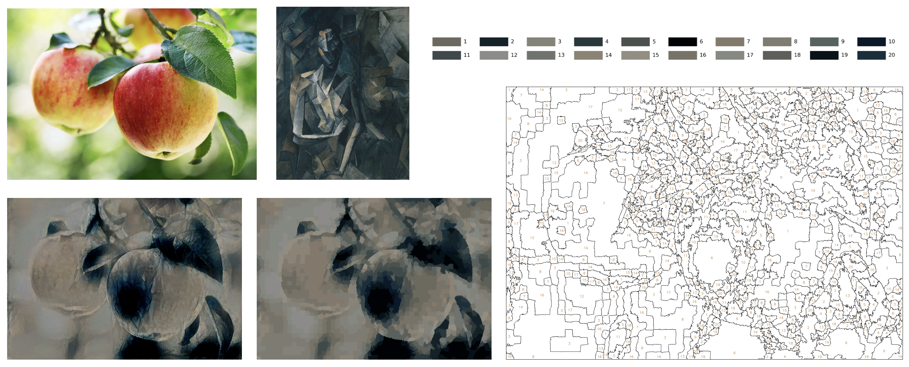

# Paint By Numbers with Neural Style Transfer


This project provides two main functionalities: a **Paint by Numbers** tool and **Neural Style Transfer (NST)**. Users can transform their photos into simplified paint-by-number patterns or apply famous artistic styles before generating a paint-by-number output.

## Features
- **Paint By Numbers Generator**: Quantise and segment images into paint-by-number patterns with a custom color palette.
- **Neural Style Transfer**: Optionally apply artistic styles to photos using a pre-trained VGG19 model before generating paint-by-number patterns.
- **Interactive Web App**: Users can upload content, choose style images, and interact with the results directly via a web interface.
- **Custom Color Palette**: View simplified palettes for paint-by-number outputs.
- **Jupyter Notebook Option**: If you prefer working in a notebook environment, you can run `NST.ipynb` to experiment with style transfer and paint-by-numbers directly.


## Installation

1. Clone the repository:
   ```bash
   git clone https://github.com/stailor2000/paint_by_numbers.git
   cd paint-by-numbers
2. Create and activate the Conda environment:
    ```bash
    conda create -n paint-by-numbers python=3.9
    conda activate paint-by-numbers
3. Install dependencies:
    ```bash
    pip install -r requirements.txt
4. Run the streamlit application:
    ```bash
    streamlit run application.py
## Usage

- You can interactively use the **Streamlit app** to upload images and generate paint-by-numbers outputs.
  
- Alternatively, run **NST.ipynb** in Jupyter Notebook to experiment with Neural Style Transfer and the paint-by-numbers process in a notebook environment.

  - Place the image you want to convert into `./data/content_images`.
  - For Neural Style Transfer, place the style images into `./data/style_images`.
  - The generated paint-by-numbers canvas along with the color palette will be saved in the `./generated_paint_by_numbers` directory.
## Paint By Numbers (Without Style Transfer)
- **Upload Content Image**: Add the photo you want to convert into a paint-by-numbers image.
- **Superpixel Segmentation**: The app segments the image using the SLIC algorithm and applies K-Means to reduce the colour palette.
- **Generate Paint By Numbers**: Create a labelled, numbered paint-by-numbers image with a simplified palette.

### Example:


---

## Neural Style Transfer (NST) + Paint By Numbers
- **Upload Content Image**: Add the photo you want to stylise.
- **Choose Style Image**: Select an artistic style image (e.g., cubism, abstract, Picasso, Van Gogh, etc.).
- **Neural Style Transfer**: Blend the content and style images using the NST model.
- **Superpixel Segmentation**: Segment the stylised image with SLIC and apply K-Means to reduce the colour palette.
- **Generate Paint By Numbers**: Create a labeled paint-by-numbers image with a color palette from the stylised output.

### Example:



---


